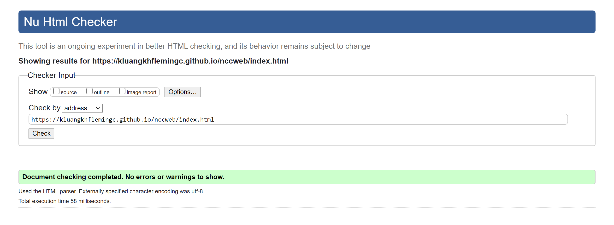
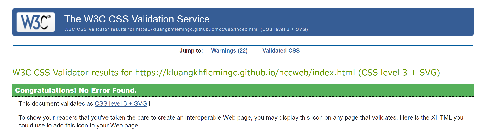
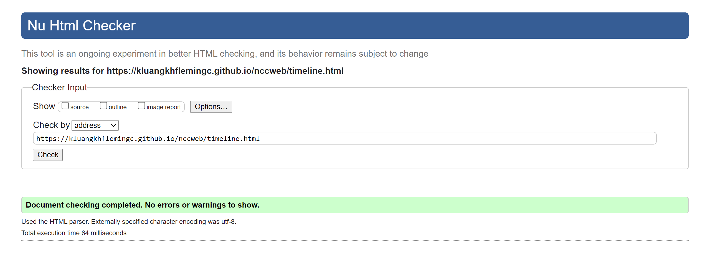
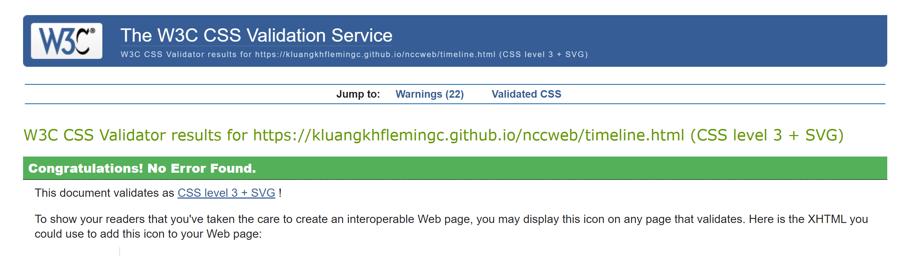
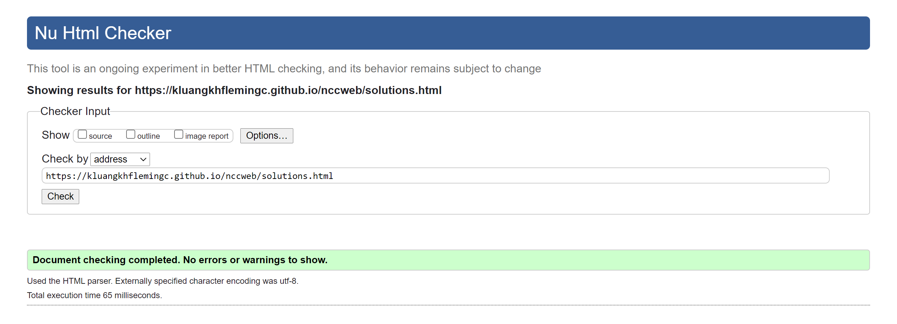
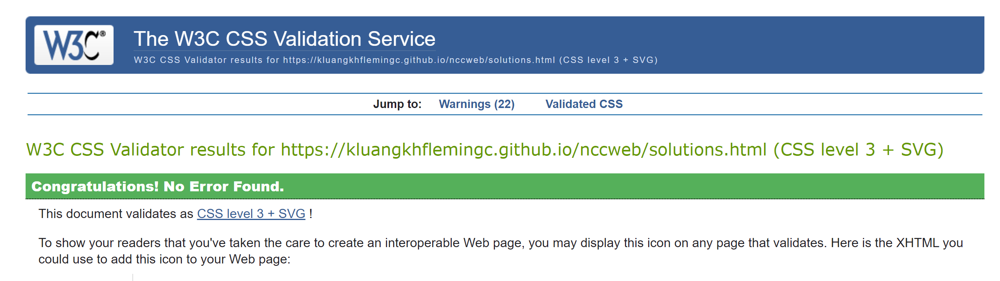

# April 19, 2021 Log Outcomes
## 1. Errors
* All images needed an 'alt' attribute
* 'alt' attribute was added to each image then webpage was run through the HTML and CSS validator again
## 2. Warnings
* Warnings for each page came from the external CSS used from a CDN: https://cdnjs.cloudflare.com/ajax/libs/font-awesome/4.7.0/css/font-awesome.min.css
* Since the external CSS is required for responsive design warnings were not fixed
## 3. HTML and CSS Validator Results for 'Home' page
* https://kluangkhflemingc.github.io/nccweb/index.html

## 4. HTML and CSS Validator Results for 'Timeline' page
* https://kluangkhflemingc.github.io/nccweb/timeline.html

## 5. HTML and CSS Validator Results for 'Solutions' page
* https://kluangkhflemingc.github.io/nccweb/solutions.html

